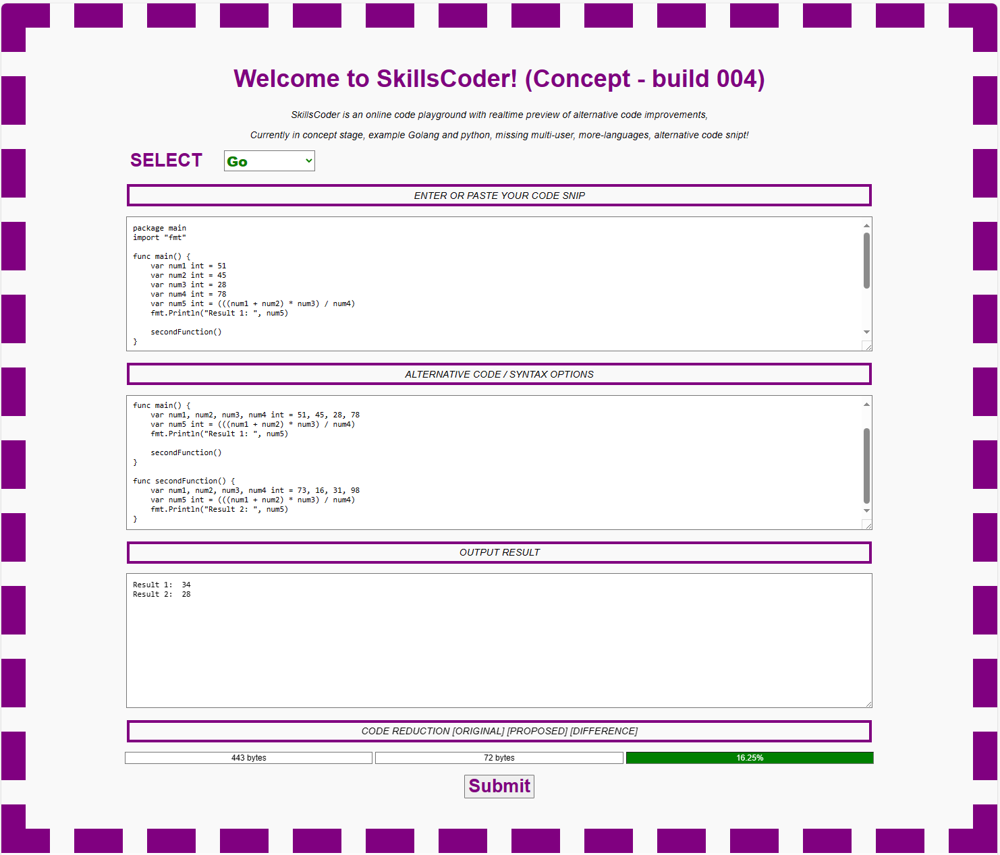

# Skills Coder

SkillsCoder is an online code playground with realtime preview of alternative code improvements, currently in concept stage, included Go and Python as this stage but will be adding multi-user, more-languages, alternative code snipt, many more coding rules!

Concept Version:
```
001 - Initial golang compiler concept
002 - Added Python interpreter & language selector
003 - Added new rules for the Go languages
004 - Added dynamic sample on code select, simple python rule, split rules in own files
005 - Added layout style for more confort
```

### Create docker for Raspberry Pi / ARM64
```
$ sudo docker-compose -f docker-compose-aarch64.yml up --build -d
```

### Create docker for x86_64 / AMD64
```
$ sudo docker-compose -f docker-compose-x86_64.yml up --build -d
```

### Pull & Install Skillscoder
```
docker pull gcclinux/skillscoder:aarch64
or
docker pull gcclinux/skillscoder:adm64
```

### Run container after pulling it down.
```
Linux:

sudo docker run \
--detach \
--interactive \
--restart=always \
--publish 80:8000 \
--volume /opt/skillscoder/repo:/app/repo \
--name SkillsCoder \
gcclinux/skillscoder:amd64
```
```
Windows:

docker run \
--detach \
--interactive \
--restart=always \
--publish 80:8000 \
--volume //c/Users/YourUser/skillscoder/repo:/app/repo \
--name SkillsCoder \
gcclinux/skillscoder:amd64
```
Update 3
