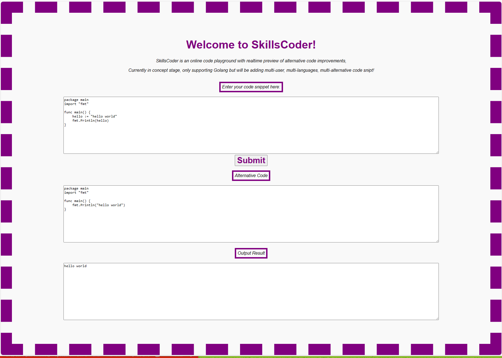

# Skills Coder

SkillsCoder is an online code playground with realtime preview of alternative code improvements, currently in concept stage, only supporting Golang but will be adding multi-user, multi-languages, multi-alternative code snipt!

```
sudo docker run \
--detach \
--interactive \
--restart=always \
--publish 80:8000 \
--name SkillsCoder \
gcclinux/skillscoder:amd64
```
