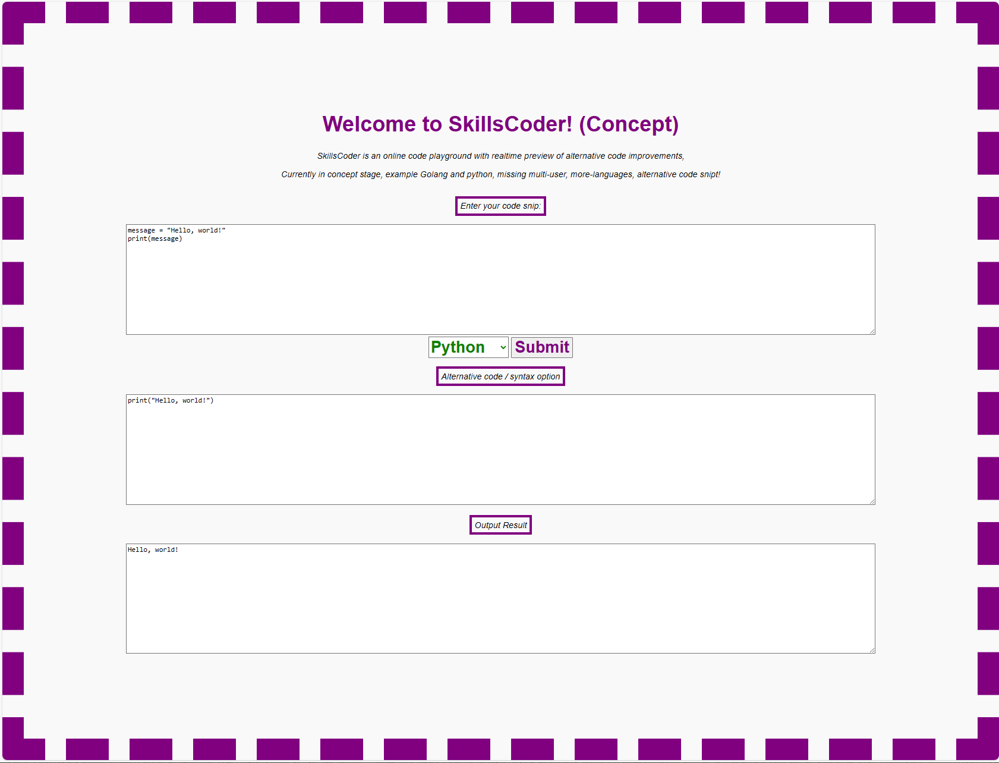

# Skills Coder

SkillsCoder is an online code playground with realtime preview of alternative code improvements, currently in concept stage, only supporting Golang but will be adding multi-user, multi-languages, multi-alternative code snipt!

Concept Version:
```
001 - Initial golang compiler concept
002 - Added Python interpreter & language selector
```

### Create docker for Raspberry Pi / ARM64
```
$ sudo docker-compose -f docker-compose-aarch64.yml up --build -d
```

### Create docker for x86_64 / AMD64
```
$ sudo docker-compose -f docker-compose-x86_64.yml up --build -d
```

### Pull & Install Skillscoder
```
docker pull gcclinux/skillscoder:aarch64
or
docker pull gcclinux/skillscoder:adm64
```

### Run container after pulling it down.
```
sudo docker run \
--detach \
--interactive \
--restart=always \
--publish 80:8000 \
--name SkillsCoder \
gcclinux/skillscoder:amd64
```
v001


v002
